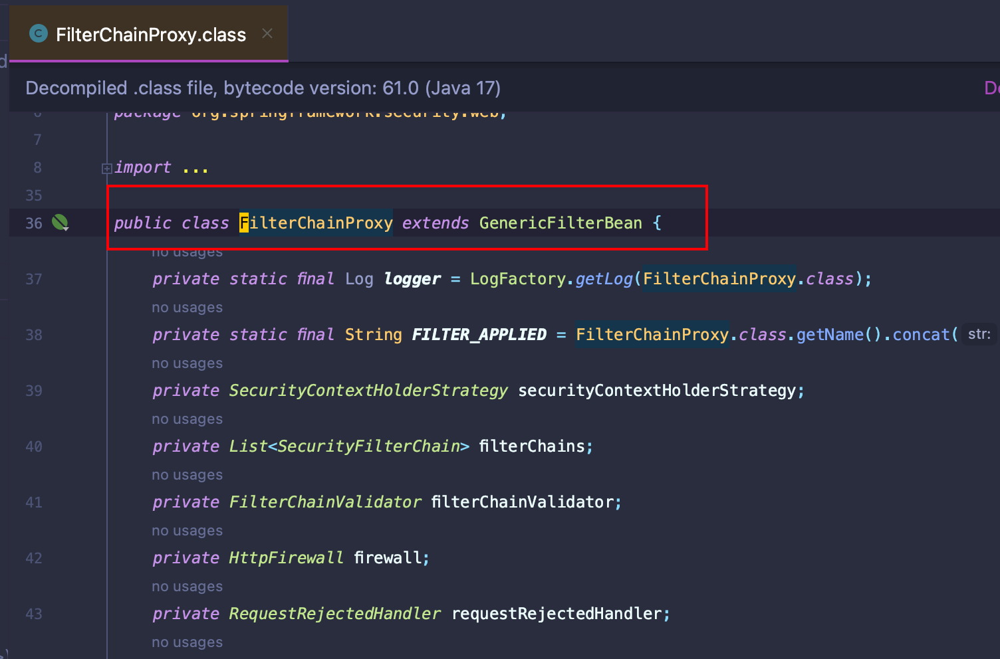

# Spring Security概述

> 官网介绍：**Spring Security is a powerful and highly customizable authentication and access-control framework. It is the de-facto standard for securing Spring-based applications.**

&emsp;Spring Security 是一个功能强大且高度可定制的身份验证和访问控制框架。它是保护Spring应用的事实标准。    

## 1. 特点

- 为身份验证和授权提供全面、可扩展的支持；
- 可以防止会话固定、点击劫持、跨站请求伪造等攻击；
- 集成了 Servlet API；
- 可选择与 Spring Web MVC 集成；

## 2. 架构

&emsp;Spring Security的本质就是一堆的**Filter**(过滤器)，这对其它身份校验、授权的框架也是一样的。这里根据我的理解记录下Spring Security的实现架构。

### 2.1 Filter (过滤器)

&emsp;`Filter`一般是指Java Servlet的过滤器。`Filter`**可以动态地拦截请求和响应，以变换或使用包含在请求或响应中的信息。**

&emsp;在Java Servlet中，可以将一个或多个`Filter`附加到一个Servlet或一组Servlet中去。`Filter`也可以附加到JSP文件或HTML页面中去。**调用Servlet前会调用所有附加的Servlet Filter**。

&emsp;Servlet Filter是可用于Servlet编程的Java类，它可以实现以下目的：

- 在客户端的请求访问后端资源之前，拦截这些请求。
- 在服务端的响应发送回客户端之前，处理这些响应。

&emsp;多个Filter会构成处理请求的过滤器链（**FilterChain**）


&emsp;客户端向服务器应用发送请求时，服务端会根据请求路径创建一个`FilterChain`,在FilterChain中包含一组过滤器的实例和处理该请求的Servlet。在Spring MVC中，一个Servlet只能处理一个请求(`HttpServletRequest`)和一个响应(`HttpServletResponse`)。但是一个Servlet可以被一组过滤器处理。并且使用Filter可以实现如下需求：

- 防止下游的 Filter 实例或 Servlet 被调用。在这种情况下，Filter 通常会使用 HttpServletResponse 对客户端写入响应。

- 修改下游的 Filter 实例和 Servlet 所使用的 HttpServletRequest 或 HttpServletResponse。

&emsp;过滤器是通过实现`javax.servlet.Filter`接口定义的三个方法实现的。代码模板如下：

```java
package com.ningning0111.test;


import javax.servlet.*;
import java.io.IOException;

public class MyFilter implements Filter {
    @Override
    public void init(FilterConfig filterConfig) throws ServletException {
        // 过滤器初始化时调用
    }

    @Override
    public void doFilter(ServletRequest servletRequest, ServletResponse servletResponse, FilterChain filterChain) throws IOException, ServletException {
        // 过滤器处理的业务

        // 将请求传回过滤链去
        filterChain.doFilter(servletRequest,servletResponse);
    }

    @Override
    public void destroy() {
        // Filter被Web移除之前调用
    }
}
```

> 由于一个Filter只会影响下一个Filter实例和Servlet，因此每一个Filter的调用顺序是十分重要的。

### 2.2 DelegatingFilterProxy (委托过滤代理)

&emsp;**Spring Web**提供了一个名为`DelegatingFilterProxy`的`Filter`实现,它将原生态的Servlet的生命周期与Spring的ApplicationContext联系了起来。

> 通俗点就是在原生态的Servlet Filter Chain中添加了一个Filter的实现，这个实现便于Spring应用定义的Filter与Servlet连接起来。

&emsp;Servlet容器允许使用自己的标准创建`Filter`实例，但它不知道Spring 所定义的Bean。因此，你可以通过标准的Servlet容器机制来注册`DelegatingFilterProxy`,并将所有的工作，委托给实现了`Filter`的Spring Bean。


&emsp;`DelegatingFilterProxy`继承了一个抽象类`GenericFilterBean`,该抽象类实现了`Filter`接口。


&emsp;`DelegatingFilterProxy`会从WebApplication中延迟加载`Filter Bean`，然后调用`Filter Bean`。


&emsp;中间调用的`findWebApplicationContext()`方法，该方法就会返回WebApplication的Context，然后将该Context传给`initDelegate`方法，该方法的功能是从WebApplication中找得到Filter Bean，并将Filter Bean返回。


&emsp;因此`DelegatingFilterProxy`的`doFilter`的流程就两步：

- 从WebApplication中延迟加载定义的`Filter Bean`;
- 调用获取的`Filter Bean`

&emsp;而委托执行Filter体现在下面几段源码:

```java
1. Filter delegateToUse = this.delegate;
2. delegateToUse = initDelegate(wac);
3. this.delegate = delegateToUse;
4. invokeDelegate(delegateToUse,...);
```

&emsp;上面提到`DelegatingFilterProxy`会延时从`WebApplication`中加载`Filter Bean`。这是因为容器在启动前，容器需要注册`Filter`实例，而Spring通常使用`ContextLoaderListener`来加载`Spring Bean`,这会在需要注册`Filter`实例之后才会完成。因此我们需要延时，等`Filter Bean`注册完成后再从WebApplicatio中加载。

### 2.3 FilterChainProxy (过滤链代理)

&emsp;`Spring Security`的`Servlet`支持在`FilterChainProxy`中。

&emsp;`FilterChainProxy`是`Spring Security`提供的一个特殊`Filter`.它允许通过`SecurityFilterChain`委托给许多的`Filter`实例。

&emsp;因为`FilterChainProxy`是一个Spring Bean，所以它会被`DelegatingFilterProxy`调用。


&emsp;在Spring Security源码中可以知道，`FilterChainProxy`也继承了Spring Web中的`GenericFilterBean`。




&emsp;源码中可以看到`FilterChainProxy`的`doFilter`方法执行了其内部实现的一个`doFilterInternal`方法，该方法其实就是**用来处理多个Spring Security的SecurityFilterChain**。


&emsp;`getFilters`方法如下：


&emsp;在该方法中，通过调用`SecurityFilterChain`的`getFilters`方法获取`Security Filter`列表。

### 2.4 SecurityFilterChain

&emsp;**SecurityFilterChain**是多个`SecurityFilter`组成的`FilterChain`。它被`FilterChainProxy`用来确定当前请求应该调用哪些`Spring Security Filter`。


&emsp;`SecurityFilterChain`中的Security Filter通常是Bean，它们是用`FilterChainProxy`注册的，而不是`DelegatingFilterProxy`注册的。与直接向Servlet容器或DelegatingFilterProxy注册相比，FilterChainProxy有很多的优势。

- 它为Spring Security的所有Servlet提供了一个起点。因此，当你想要对Spring Security的Servlet进行Debug时，在`FilterChainProxy`添加一个调试点是一个不错的选择。
- `FilterChainProxy`是`Spring Security`的核心，它可以执行一些不被视为可有可无的任务。例如：清除`SecurityContext`以避免内存泄漏，应用Spring Security的`HttpFirewall`来保护应用程序免受某些攻击。
- `FilterChainProxy`在确定何时应该调用`SecurityFilterChain`方面提供了更大的灵活性。在Servlet容器中，Filter实例仅基于URL被调用。然而，`FilterChainProxy`可以通过使用`RequestMatcher`接口，根据`HttpServletRequest`中的任何内容确定调用。


&emsp;`FilterChainProxy`决定应该使用哪个`SecurityFilterChain`。当然，它需要对每个`SecurityFilterChain`中的第一个`Security Filter`进行匹配。

&emsp;比如，请求路径为`/api/v1/users`,那么它会首先与`/api/**`模式匹配上，并执行对应的`SecurityFilterChain`。若请求路径为`/users`,那么它与`/api/**`模式不匹配，而是与`/**`模式匹配，从而执行`/**`对应的`SecurityFilterChain`。

> 对于每一个`SecurityFilterChain`,它是唯一的，但它可以配置任意多个`SecurityFilter`。

### 2.5 SecurityFilter

&emsp;`SecurityFilter`是Spring Security提供的用于**认证、授权、漏洞保护**等等功能的Filter统称。


&emsp;这些`Security Filter`有一个共同的抽象父类`OncePerRequestFilter`。该类保证在任何`Servlet`容器上每个请求分派单次执行。它提供了带有`HttpServletRequest`和`HttpServletResponse`参数的`doFilterInternal`方法。`SecurityFilter`通过继承该抽象类，重写`doFilterInternal`方法即可实现各种Filter功能。

&emsp;Filter是按照特定顺序执行的，这样才能保证它们在正确的时间点上被调用。比如在执行认证Filter时，需要先执行授权Filter。但一般来说，我们是不需要知道Spring Security的Filter执行顺序。不过我们可以从`FilterOrderRegistration`类中了解到Spring Security的Filter执行顺序，它在`org.springframework.security.config.annotation.web.builders`包下。


## 3. 第一个Hello Spring Security程序

&emsp;这里演示第一个`Hello Spring Security`的Spring Security程序。环境要求如下：

- JDK >= 17
- Spring 3.x


### 3.1 构建Spring项目


### 3.2 创建Controller

&emsp;这里创建一个`IndexController`类，用于处理首页请求。

```java
package com.ningning0111.springsecuritydemo1.controller;

import org.springframework.web.bind.annotation.GetMapping;
import org.springframework.web.bind.annotation.RestController;

@RestController
public class IndexController {
    @GetMapping("/")
    public String rootPath(){
        return "Spring Application";
    }
    @GetMapping("/index")
    public String index(){
        return "Hello Spring Security!";
    }
}
```

### 3.3 创建SecurityConfig

&emsp;创建`SecurityConfig`类用来配置`SpringSecurity`，在这里先不进行任何配置，就简单的加入一个`@EnableWebSecurity`注解，该注解表示开启SpringSecurity。

```java
package com.ningning0111.springsecuritydemo1.config;

import org.springframework.context.annotation.Bean;
import org.springframework.context.annotation.Configuration;
import org.springframework.security.config.annotation.web.configuration.EnableWebSecurity;
import org.springframework.security.core.userdetails.User;
import org.springframework.security.core.userdetails.UserDetails;
import org.springframework.security.core.userdetails.UserDetailsService;
import org.springframework.security.crypto.password.NoOpPasswordEncoder;
import org.springframework.security.crypto.password.PasswordEncoder;
import org.springframework.security.provisioning.InMemoryUserDetailsManager;

@Configuration
@EnableWebSecurity
public class SecurityConfig {
}

```

### 3.4 启动Spring容器

&emsp;启动Spring容器后，控制台会打印出下述内容：


&emsp;意思就是**你没有设置相关的用户信息，SpringSecurity为你生成了一个密码，该密码仅用于开发环境，当你要进行项目部署时，请更新该密码**。

&emsp;我们可以将密码复制一下，然后通过浏览器访问`localhost:8080/index`,你会发现浏览器默认给你跳转到了`localhost:8080/login`页面。


> 若无法出现Login页面，请通过使用的浏览器打开一个隐私窗口，通过隐私窗口访问。

&emsp;这里的密码就是刚刚控制台输出的Spring Security为你生成的密码，而用户名呢?通过控制台输出的信息，可以发现这个包含密码的日志是从`UserDetailsServiceAutoConfiguration`类输出的。我们可以连续按两次`Shift`,搜索该类。


&emsp;再次追根溯源下，进入`getName()`方法，它跳转到了一个`User`类，从该类就可以发现name被默认设置了`user`，密码是通过UUID生成的。


&emsp;知道这些后，我们就能顺利登陆了。


> 登陆之后，访问`index`即可。

## 4. 配置自定义用户名和密码

&emsp;如果我们不配置用户名和密码，每次启动Spring项目时，都需要从控制台复制Security提供的密码进行验证登陆，这是非常繁琐的。这里我将介绍两种设置自定义密码的方式。

### 4.1 配置文件设置自定义用户名和密码

&emsp;我们找到登录用户名的那个类`SecurityProperties`，它是一个配置类，通过配置文件设置自定义用户名和密码就可以修改默认用户名和密码，这是最简单的实现方式。


&emsp;但是我们无法通过配置文件配置多个账户。

### 4.2 通过配置类配置自定义用户名和密码

&emsp;通过配置类配置自定义用户名和密码其实在上面3.4中已经提到过的，我们可以从`UserDetailsServiceAutoConfiguration`类中了解到SpringSecurity是如何为我们提供默认用户名和密码的。关键地方就在于返回`InMemoryUserDetailsManager`实例，因此我们依葫芦画瓢实现自定义配置。


&emsp;配置类

```java
package com.ningning0111.springsecuritydemo1.config;

import org.springframework.context.annotation.Bean;
import org.springframework.context.annotation.Configuration;
import org.springframework.security.config.annotation.web.configuration.EnableWebSecurity;
import org.springframework.security.core.userdetails.User;
import org.springframework.security.core.userdetails.UserDetails;
import org.springframework.security.core.userdetails.UserDetailsService;
import org.springframework.security.crypto.password.NoOpPasswordEncoder;
import org.springframework.security.crypto.password.PasswordEncoder;
import org.springframework.security.provisioning.InMemoryUserDetailsManager;

/**
 * @Project: com.ningning0111.springsecuritydemo1.config
 * @Author: pgthinker
 * @Date: 2023/12/4 14:20
 * @Description:
 */
@Configuration
@EnableWebSecurity
public class SecurityConfig {
    @Bean
    public UserDetailsService initUsers(){
        UserDetails admin = User.withUsername("admin").password("123456").build();
        UserDetails user = User.withUsername("user").password("11111").build();
        UserDetails visitor = User.withUsername("visitor").password("333333").build();

        InMemoryUserDetailsManager inMemoryUserDetailsManager = new InMemoryUserDetailsManager();
        inMemoryUserDetailsManager.createUser(admin);
        inMemoryUserDetailsManager.createUser(user);
        inMemoryUserDetailsManager.createUser(visitor);
        return inMemoryUserDetailsManager;
    }
}

```

&emsp;不过这里还是会有一个问题。我们启动Spring容器后，通过设置的用户名和密码登录，会发现无法登录成功，并且控制台会报如下错误信息。


&emsp;它提示我们**PasswordEncoder(密码编码器)实例为null**。这里的`PasswordEncoder`是SpringSecurity为我们提供的一个密码加密接口，SpringSecurity要求开发者必须对密码进行加密，这就要求我们提供一个`PasswordEncoder`的实现类的实例。


> 该接口中定义了两个重要的方法，分别是`encode`和`matches`,`encode`方法用于将密码进行加密，`matches`方法用于对比明文密码和加密后的暗文是否一致。而另外一个`upgradeEncoding`方法则是用来判断是否对密码进行再次加密。

&emsp;这里为了简单起见，我们可以返回一个`NoOpPasswordEncoder`实例，这是SpringSecurity为我们提供的不对密码进行任何操作的`PasswordEncoder`。因此，完整的配置类如下：

```java
package com.ning.springsecuritystudydemo.config;

import org.springframework.context.annotation.Bean;
import org.springframework.context.annotation.Configuration;
import org.springframework.security.config.annotation.web.configuration.EnableWebSecurity;
import org.springframework.security.core.userdetails.User;
import org.springframework.security.crypto.password.NoOpPasswordEncoder;
import org.springframework.security.crypto.password.PasswordEncoder;
import org.springframework.security.provisioning.InMemoryUserDetailsManager;

@EnableWebSecurity
@Configuration
public class SecurityConfig {

    @Bean
    public PasswordEncoder definePasswordEncoder(){
        return NoOpPasswordEncoder.getInstance();
    }

    @Bean
    public InMemoryUserDetailsManager init(){

        return new InMemoryUserDetailsManager(
                User.withUsername("admin").password("123456").roles("admin","user").build()
        );
    }
}
```

> 对于没有配置密码加密器而报错这个问题，我们还可以设置密码的时候，在密码的前面添加前缀`{noop}`指示该密码不需要进行加密,这样即使没有配置`PasswordEncoder`，SpringSecurity也能正常认证。

&emsp;配置多个用户的配置如下:

```java
package com.ningning0111.springsecuritydemo1.config;

import org.springframework.context.annotation.Bean;
import org.springframework.context.annotation.Configuration;
import org.springframework.security.config.annotation.web.configuration.EnableWebSecurity;
import org.springframework.security.core.userdetails.User;
import org.springframework.security.core.userdetails.UserDetails;
import org.springframework.security.core.userdetails.UserDetailsService;
import org.springframework.security.crypto.password.NoOpPasswordEncoder;
import org.springframework.security.crypto.password.PasswordEncoder;
import org.springframework.security.provisioning.InMemoryUserDetailsManager;

@Configuration
@EnableWebSecurity
public class SecurityConfig {
    @Bean
    public UserDetailsService initUsers(){
        UserDetails admin = User.withUsername("admin").password("123456").build();
        UserDetails user = User.withUsername("user").password("11111").build();
        UserDetails visitor = User.withUsername("visitor").password("333333").build();

        InMemoryUserDetailsManager inMemoryUserDetailsManager = new InMemoryUserDetailsManager();
        inMemoryUserDetailsManager.createUser(admin);
        inMemoryUserDetailsManager.createUser(user);
        inMemoryUserDetailsManager.createUser(visitor);
        return inMemoryUserDetailsManager;
    }

   @Bean
   public PasswordEncoder initPasswordEncoder(){
       return NoOpPasswordEncoder.getInstance();
   }
}
```

&emsp;然后我们再通过我们设置的任意用户的用户名和密码进行登录就行啦。

## 5. 关于默认登录的小Tip

&emsp;当我们没有自定义登录页面时，`SpringSecurity`默认会使用[`DefaultLoginPageGeneratingFilter`](https://github.com/spring-projects/spring-security/blob/master/web/src/main/java/org/springframework/security/web/authentication/ui/DefaultLoginPageGeneratingFilter.java)过滤器生成登录页面,它在`org.springframework.security.web.authentication.ui`包下，源码中，登录接口默认为`/login`,因此，如果我们想自定义登录页面，只需通过controller类配置`/login`映射即可。


