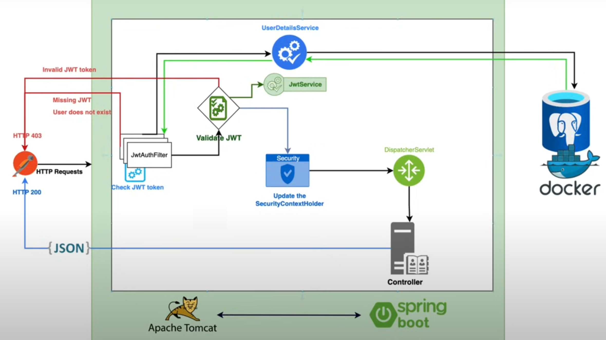
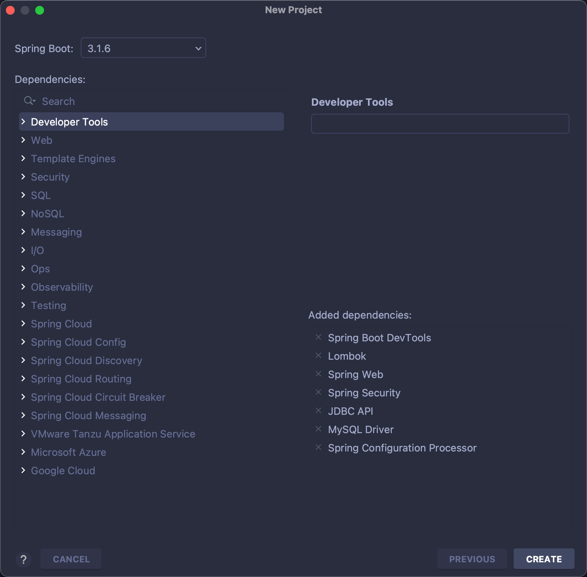

# Authentication

&emsp;Authentication是"认证"的意思，在实际开发中，我们的系统需要有一套认证和授权服务来保证我们系统的安全性,在Java生态中，主要有[Spring Security](https://github.com/spring-projects/spring-security)和[Apache Shiro](https://github.com/apache/shiro)两个安全框架可以完成认证和授权的功能。

> 什么是认证和授权？
>
> `认证`与`授权`是信息安全领域的两个重要概念，认证是指验证用户或实体身份是否合法和有效；授权是基于认证的基础上，为用户或实体分配相应的权限和访问权限。举一个例子：**假设你是一名员工，需要访问公司内部的资源系统，你就需要提供自己的员工号和密码进行认证，公司内部的文件系统会验证你的身份是否合法，一旦验证成功，系统就会根据你的职位和角色为你分配相应的资源访问权限。在整个流程中，认证确定了你的身份的合法性，授权决定了你能访问哪些资源**。

## 一、Spring Security的认证流程是什么？

### 1. 核心类的基本介绍

#### 1.1 AuthenticationManager

&emsp;[AuthenticationManager](https://github.com/spring-projects/spring-security/blob/main/core/src/main/java/org/springframework/security/authentication/AuthenticationManager.java)是`Spring Security`的核心认证器接口,它提供了一个唯一的方法`authenticate`,该方法会接收一个`Authentication`对象作为参数进行认证，若认证失败，则会抛出异常，认证成功，则会向传进来的`Authentication`对象中填充相关的信息（包括权限信息），并返回。


```java
public interface AuthenticationManager {
	Authentication authenticate(Authentication authentication) throws AuthenticationException;
}
```

#### 1.2 ProviderManager

&emsp;[ProviderManager](https://github.com/spring-projects/spring-security/blob/main/core/src/main/java/org/springframework/security/authentication/ProviderManager.java)是`AuthenticationManager`的一个实现类,主要用于管理多个认证提供者(AuthenticationProvider)，并委托给它们进行用户身份认证。`ProviderManager`会根据配置的`AuthenticationProvider`列表，依次调用它们的`authenticate`方法进行用户身份认证。当一个`AuthenticationProvider`成功认证用户身份后，`ProviderManager`就会返回一个认证成功的`Authentication`对象，否则会抛出异常。

&emsp;省略了部分源代码：

```java

public class ProviderManager implements AuthenticationManager, MessageSourceAware, InitializingBean {

	private List<AuthenticationProvider> providers = Collections.emptyList();

	public ProviderManager(AuthenticationProvider... providers) {
		this(Arrays.asList(providers), null);
	}

	public ProviderManager(List<AuthenticationProvider> providers) {
		this(providers, null);
	}

	public ProviderManager(List<AuthenticationProvider> providers, AuthenticationManager parent) {
		Assert.notNull(providers, "providers list cannot be null");
		this.providers = providers;
		this.parent = parent;
		checkState();
	}

	@Override
	public Authentication authenticate(Authentication authentication) throws AuthenticationException {
		Class<? extends Authentication> toTest = authentication.getClass();
		AuthenticationException lastException = null;
		AuthenticationException parentException = null;
		Authentication result = null;
		Authentication parentResult = null;
		int currentPosition = 0;
		int size = this.providers.size();
		for (AuthenticationProvider provider : getProviders()) {
			if (!provider.supports(toTest)) {
				continue;
			}
			if (logger.isTraceEnabled()) {
				logger.trace(LogMessage.format("Authenticating request with %s (%d/%d)",
						provider.getClass().getSimpleName(), ++currentPosition, size));
			}
			try {
				result = provider.authenticate(authentication);
				if (result != null) {
					copyDetails(authentication, result);
					break;
				}
			}
			catch (AccountStatusException | InternalAuthenticationServiceException ex) {
				prepareException(ex, authentication);
				throw ex;
			}
			catch (AuthenticationException ex) {
				lastException = ex;
			}
		}
		if (result == null && this.parent != null) {
			try {
				parentResult = this.parent.authenticate(authentication);
				result = parentResult;
			}
			catch (ProviderNotFoundException ex) {
			}
			catch (AuthenticationException ex) {
				parentException = ex;
				lastException = ex;
			}
		}
		if (result != null) {
			if (this.eraseCredentialsAfterAuthentication && (result instanceof CredentialsContainer)) {
				((CredentialsContainer) result).eraseCredentials();
			}
			if (parentResult == null) {
				this.eventPublisher.publishAuthenticationSuccess(result);
			}
			return result;
		}
		if (lastException == null) {
			lastException = new ProviderNotFoundException(this.messages.getMessage("ProviderManager.providerNotFound",
					new Object[] { toTest.getName() }, "No AuthenticationProvider found for {0}"));
		}
		if (parentException == null) {
			prepareException(lastException, authentication);
		}
		throw lastException;
	}

}
```

#### 1.3 Authentication

&emsp;[Authentication](https://github.com/spring-projects/spring-security/blob/main/core/src/main/java/org/springframework/security/core/Authentication.java)接口代表了一个用户的身份认证信息，它包含了用户的主体(principal)和凭证(credentials)，以及用户的权限(authorities)等信息。

```java
public interface Authentication extends Principal, Serializable {

    // 返回用户的权限列表
	Collection<? extends GrantedAuthority> getAuthorities();
    // 返回用户的凭证，通常是用户的密码或其他认证凭证
	Object getCredentials();
    // 返回认证时包含的信息
	Object getDetails();
    // 返回用户的主体对象，通常是一个表示用户身份的对象
	Object getPrincipal();
    // 返回用户是否已经通过了身份认证
	boolean isAuthenticated();
    // 设置用户身份的认证状态
	void setAuthenticated(boolean isAuthenticated) throws IllegalArgumentException;
}
```

#### 1.4 AbstractAuthenticationToken

&emsp;[AbstractAuthenticationToken](https://github.com/spring-projects/spring-security/blob/main/core/src/main/java/org/springframework/security/authentication/AbstractAuthenticationToken.java)是Spring Security中的一个核心抽象类，它实现了`Authentication`接口，用于表示用户的认证信息，同时它也是许多具体认证Token类的父类，通常存储了关于主体（即用户）的信息。

#### 1.5 UsernamePasswordAuthenticationToken

&emsp;[UsernamePasswordAuthenticationToken](https://github.com/spring-projects/spring-security/blob/main/core/src/main/java/org/springframework/security/authentication/UsernamePasswordAuthenticationToken.java)是AbstractAuthenticationToken的一个具体实现类，主要用于处理基于用户名和密码认证。


#### 1.6 AuthenticationProvider

&emsp;[AuthenticationProvider](https://github.com/spring-projects/spring-security/blob/main/core/src/main/java/org/springframework/security/authentication/AuthenticationProvider.java)是Spring Security的一个核心接口，用于实现不同类型的认证机制。它负责对提交的`Authentication`请求进行验证和处理。

&emsp;`AuthenticationManager`管理了一组`AuthenticationProvider`,前者会将认证请求委托给它管理的`AuthenticationProvider`，直到其中一个能够处理该请求为止。

#### 1.7 AbstractUserDetailsAuthenticationProvider

&emsp;[AbstractUserDetailsAuthenticationProvider](https://github.com/spring-projects/spring-security/blob/main/core/src/main/java/org/springframework/security/authentication/dao/AbstractUserDetailsAuthenticationProvider.java)是Spring Security中的一个抽象类，实现了`AuthenticationProvider`接口，用于基于`UserDetails`服务的认证过程，这个类提供了一种机制，用于从`UserDetailsService`中加载用户信息，并对用户提交的认证信息进行认证。

```java
public abstract class AbstractUserDetailsAuthenticationProvider
		implements AuthenticationProvider, InitializingBean, MessageSourceAware {

	private UserDetailsChecker preAuthenticationChecks = new DefaultPreAuthenticationChecks();

	private UserDetailsChecker postAuthenticationChecks = new DefaultPostAuthenticationChecks();


	@Override
	public Authentication authenticate(Authentication authentication) throws AuthenticationException {
		Assert.isInstanceOf(UsernamePasswordAuthenticationToken.class, authentication,
				() -> this.messages.getMessage("AbstractUserDetailsAuthenticationProvider.onlySupports",
						"Only UsernamePasswordAuthenticationToken is supported"));
		String username = determineUsername(authentication);
		boolean cacheWasUsed = true;
		UserDetails user = this.userCache.getUserFromCache(username);
		if (user == null) {
			cacheWasUsed = false;
			try {
				user = retrieveUser(username, (UsernamePasswordAuthenticationToken) authentication);
			}
			catch (UsernameNotFoundException ex) {
				this.logger.debug("Failed to find user '" + username + "'");
				if (!this.hideUserNotFoundExceptions) {
					throw ex;
				}
				throw new BadCredentialsException(this.messages
					.getMessage("AbstractUserDetailsAuthenticationProvider.badCredentials", "Bad credentials"));
			}
			Assert.notNull(user, "retrieveUser returned null - a violation of the interface contract");
		}
		try {
			this.preAuthenticationChecks.check(user);
			additionalAuthenticationChecks(user, (UsernamePasswordAuthenticationToken) authentication);
		}
		catch (AuthenticationException ex) {
			if (!cacheWasUsed) {
				throw ex;
			}
			// There was a problem, so try again after checking
			// we're using latest data (i.e. not from the cache)
			cacheWasUsed = false;
			user = retrieveUser(username, (UsernamePasswordAuthenticationToken) authentication);
			this.preAuthenticationChecks.check(user);
			additionalAuthenticationChecks(user, (UsernamePasswordAuthenticationToken) authentication);
		}
		this.postAuthenticationChecks.check(user);
		if (!cacheWasUsed) {
			this.userCache.putUserInCache(user);
		}
		Object principalToReturn = user;
		if (this.forcePrincipalAsString) {
			principalToReturn = user.getUsername();
		}
		return createSuccessAuthentication(principalToReturn, authentication, user);
	}

    private class DefaultPreAuthenticationChecks implements UserDetailsChecker {

		@Override
		public void check(UserDetails user) {
            // 源码部分
		}

	}

	private class DefaultPostAuthenticationChecks implements UserDetailsChecker {

		@Override
		public void check(UserDetails user) {
            // 源码部分
		}

	}


}
```

#### 1.8 DaoAuthenticationProvider

&emsp;[DaoAuthenticationProvider](https://github.com/spring-projects/spring-security/blob/main/core/src/main/java/org/springframework/security/authentication/dao/DaoAuthenticationProvider.java)是`AbstractUserDetailsAuthenticationProvider`的一个实现类，特别适用于那些将用户信息存储在数据库中的应用程序，它使用`UserDetailsService`接口从数据库或其他数据源检索用户信息。

#### 1.9 UserDetailsService

&emsp;[UserDetailsService](https://github.com/spring-projects/spring-security/blob/main/core/src/main/java/org/springframework/security/core/userdetails/UserDetailsService.java)接口定义了一个加载`UserDetails`对象的接口。

```java
public interface UserDetailsService {
	UserDetails loadUserByUsername(String username) throws UsernameNotFoundException;
```

#### 1.10 UserDetails

&emsp;[UserDetails]()用于封装用户认证的详细信息。

```java
public interface UserDetails extends Serializable {
    // 权限集合
	Collection<? extends GrantedAuthority> getAuthorities();
    // 密码
	String getPassword();
    // 用户名
	String getUsername();
    // 账户是否过期
	boolean isAccountNonExpired();
    // 账户是否被锁定
	boolean isAccountNonLocked();
    // 账户的密码是否过期
	boolean isCredentialsNonExpired();
    // 账户是否可用，可理解是否删除
	boolean isEnabled();

}
```

#### 1.11 UserDetailsManager

&emsp;[UserDetailsManager](https://github.com/spring-projects/spring-security/blob/main/core/src/main/java/org/springframework/security/provisioning/UserDetailsManager.java)是一个接口，定义了用户认证详细信息的管理操作。

```java
public interface UserDetailsManager extends UserDetailsService {

	void createUser(UserDetails user);

	void updateUser(UserDetails user);

	void deleteUser(String username);

	void changePassword(String oldPassword, String newPassword);

	boolean userExists(String username);

}
```

#### 1.12 InMemoryUserDetailsManager

&emsp;[InMemoryUserDetailsManager]()主要是基于`内存`对User进行增删改查的方法（使用Map对UserDetails进行存储）。

```java
public class InMemoryUserDetailsManager implements UserDetailsManager, UserDetailsPasswordService {
	private final Map<String, MutableUserDetails> users = new HashMap<>();

	public InMemoryUserDetailsManager(Collection<UserDetails> users) {
		for (UserDetails user : users) {
			createUser(user);
		}
	}

	public InMemoryUserDetailsManager(UserDetails... users) {
		for (UserDetails user : users) {
			createUser(user);
		}
	}
}
```


#### 1.13 总结

&emsp;`UserDetailsService`接口作为桥梁，将`DaoAuthenticationProvider`与用户信息源（数据库、内存等）进行解耦。`UserDetailsService`由`UserDetails`和`UserDetailsManager`构成，前者对用户基本信息进行了封装，后者对用户基本信息进行管理。`UserDetailsService`、`UserDetails`和`UserDetailsManager`均是可以进行拓展，我们可以通过继承这些接口提供自己的用户数据源和管理用户的方法。


### 2. 认证过程的时序图


## 二、 实操案例(一)

&emsp;这一部分将根据用户数据源编写一些认证的实操案例：

- 基于内存的认证
- 给予数据库的认证

### 1. 需求分析

&emsp;实现一个前后端不分离案例，使用`thymeleaf`创建两个页面`index.html`,`login.html`,`/login_page`是登录页面接口,`/index`是首页接口。提供一系列用户信息（包括用户名和密码），未登录状态访问`/index`会自动跳转到`/login_page`页面进行登录,登录成功后，访问`/index`。

### 2. 项目创建

#### 2.1 页面

&emsp;这里的页面使用的是模板引擎，需要将`*.html`放在`template`下。

&emsp;index.html

```html
<!DOCTYPE html>
<html lang="en">
<head>
    <meta charset="UTF-8" xmlns:th="http://www.thymeleaf.org">
    <title>Index</title>
</head>
<body>
  <span>This is a index page.</span>
</body>
</html>
```

&emsp;login.html

```html
<!DOCTYPE html>
<html lang="en">
<head>
    <meta charset="UTF-8" xmlns:th="http://www.thymeleaf.org">
    <title>Login</title>
</head>
<body>
  <span>This is a login page.</span>

    <form action="/login" method="post">
        用户名：<input type="text" name="username" placeholder="请输入用户名"> <br>
        密码：<input type="password" name="password" placeholder="请输入密码"> <br>
        <input type="submit" value="提交">
    </form>
</body>
</html>
```

#### 2.2 创建对应的接口

&emsp;IndexController类:

```java
package com.ningning0111.springsecuritydemo2.controller;

import org.springframework.stereotype.Controller;
import org.springframework.web.bind.annotation.GetMapping;

@Controller
public class IndexController {
    @GetMapping("/index")
    public String index(){
        return "index";
    }
}
```

&emsp;LoginController类：

```java
package com.ningning0111.springsecuritydemo2.controller;

import org.springframework.stereotype.Controller;
import org.springframework.web.bind.annotation.GetMapping;

@Controller
public class LoginController {
    @GetMapping("/login_page")
    public String loginPage(){
        return "login";
    }
}
```

#### 2.3 基于内存的认证

&emsp;基于内存的认证其实在我们的入门案例中就使用到了。配置内容如下：


```java
package com.ningning0111.springsecuritydemo2.config;

import org.springframework.context.annotation.Bean;
import org.springframework.context.annotation.Configuration;
import org.springframework.security.config.annotation.web.builders.HttpSecurity;
import org.springframework.security.config.annotation.web.configuration.EnableWebSecurity;
import org.springframework.security.config.annotation.web.configurers.AbstractHttpConfigurer;
import org.springframework.security.core.userdetails.User;
import org.springframework.security.core.userdetails.UserDetails;
import org.springframework.security.core.userdetails.UserDetailsService;
import org.springframework.security.crypto.password.NoOpPasswordEncoder;
import org.springframework.security.crypto.password.PasswordEncoder;
import org.springframework.security.provisioning.InMemoryUserDetailsManager;
import org.springframework.security.web.SecurityFilterChain;

@Configuration
@EnableWebSecurity
public class SecurityConfig {
    @Bean
    public UserDetailsService initUsers(){
		// 基于内存存储一些用户数据
        UserDetails admin = User.withUsername("admin").password("123456").build();
        UserDetails user = User.withUsername("user").password("11111").build();
        UserDetails visitor = User.withUsername("visitor").password("333333").build();

        InMemoryUserDetailsManager inMemoryUserDetailsManager = new InMemoryUserDetailsManager();
        inMemoryUserDetailsManager.createUser(admin);
        inMemoryUserDetailsManager.createUser(user);
        inMemoryUserDetailsManager.createUser(visitor);
        return inMemoryUserDetailsManager;
    }

    @Bean
    public PasswordEncoder initPasswordEncoder(){
        return NoOpPasswordEncoder.getInstance();
    }

    @Bean
    public SecurityFilterChain initFilter(HttpSecurity http) throws Exception  {

        http.authorizeHttpRequests(authorization -> authorization
                // 设置`/login_page`路径允许所有人访问
                .requestMatchers("/login_page").permitAll()
                // 其它访问路径，均需要进行认证
                .anyRequest().authenticated());

        http.formLogin(login -> login
                // 设置登录页面为：`/login_page`
                .loginPage("/login_page")
                // 设置登录接口：这里的/login是Spring Security默认提供的，使用post请求
                .loginProcessingUrl("/login")
                // 登录成功后访问的路径
                .defaultSuccessUrl("/index"));
        // 禁用CSRF保护
        http.csrf(AbstractHttpConfigurer::disable);

        return http.build();
    }
}
```

#### 2.4 基于数据库的认证（整合Mybatis-plus）

&emsp;先创建一个`users`表（数据库根据自己的情况是否创建，我这里创建了`spring_security_study`的数据库），包含`user_id`
、`user_name`、`user_password`，3个字段。

```sql
# 创建users表
create table users(
    user_id INT PRIMARY KEY AUTO_INCREMENT,
	user_name VARCHAR(255) NOT NULL,
	user_password VARCHAR(255) NOT NULL
);
# 插入一些测试数据
INSERT INTO users (user_name, user_password) 
VALUES 	('admin', '123456'), 
		('user', '11111'), 
		('visitor', '333333');
```

&emsp;然后引入Mybatis-plus和数据库的相关依赖。

```xml
		<dependency>
			<groupId>org.springframework.boot</groupId>
			<artifactId>spring-boot-starter-jdbc</artifactId>
		</dependency>
		<dependency>
			<groupId>com.mysql</groupId>
			<artifactId>mysql-connector-j</artifactId>
			<scope>runtime</scope>
		</dependency>
		<dependency>
			<groupId>com.baomidou</groupId>
			<artifactId>mybatis-plus-boot-starter</artifactId>
			<version>3.5.4</version>
		</dependency>
```

&emsp;配置完数据库的相关信息后，创建一个`User`类，它映射的是表中的数据同时，我们需要让它实现`UserDetails`接口。

```java
package com.ningning0111.springsecuritydemo2.entity;

import com.baomidou.mybatisplus.annotation.IdType;
import com.baomidou.mybatisplus.annotation.TableField;
import com.baomidou.mybatisplus.annotation.TableId;
import com.baomidou.mybatisplus.annotation.TableName;
import lombok.Data;
import org.springframework.security.core.GrantedAuthority;
import org.springframework.security.core.userdetails.UserDetails;

import java.io.Serializable;
import java.util.Collection;

@Data
@TableName("users")
public class User implements UserDetails {
    @TableId(value = "user_id", type = IdType.AUTO)
    private Integer userId;
    @TableField(value = "user_name")
    private String username;
    @TableField(value = "user_password")
    private String password;
    @Override
    public String getPassword(){
        return password;
    }
    @Override
    public String getUsername(){
        return username;
    }
    // 返回用户权限列表
    @Override
    public Collection<? extends GrantedAuthority> getAuthorities() {
        return null;
    }
	// 账户是否没过期，返回True，下同，否则无法登录
    @Override
    public boolean isAccountNonExpired() {
        return true;
    }

    @Override
    public boolean isAccountNonLocked() {
        return true;
    }

    @Override
    public boolean isCredentialsNonExpired() {
        return true;
    }

    @Override
    public boolean isEnabled() {
        return true;
    }
}

```

&emsp;编写`UserMapper`接口。

```java
package com.ningning0111.springsecuritydemo2.mapper;

import com.baomidou.mybatisplus.core.mapper.BaseMapper;
import com.ningning0111.springsecuritydemo2.entity.User;
import org.apache.ibatis.annotations.Mapper;

@Mapper
public interface UserMapper extends BaseMapper<User> {
}
```

&emsp;编写`IUserService`接口，并实现该接口。

```java
package com.ningning0111.springsecuritydemo2.service;

import com.ningning0111.springsecuritydemo2.entity.User;

public interface IUserService {
    User queryOne(String username);
}

```

```java
package com.ningning0111.springsecuritydemo2.service.impl;

import com.baomidou.mybatisplus.core.conditions.query.QueryWrapper;
import com.baomidou.mybatisplus.extension.service.impl.ServiceImpl;
import com.ningning0111.springsecuritydemo2.entity.User;
import com.ningning0111.springsecuritydemo2.mapper.UserMapper;
import com.ningning0111.springsecuritydemo2.service.IUserService;
import org.springframework.stereotype.Service;

@Service
public class IUserServiceImpl  implements IUserService {
    private final UserMapper userMapper;

    public IUserServiceImpl(UserMapper userMapper) {
        this.userMapper = userMapper;
    }

    @Override
    public User queryOne(String username) {
        QueryWrapper<User> userQueryWrapper = new QueryWrapper<>();
        userQueryWrapper.eq("user_name",username);
        return userMapper.selectOne(userQueryWrapper);
    }
}

```

&emsp;我们参考基于内存的认证方式，知道只需要传入一个`UserDetailsService`实现Bean即可，因此，我们可以创建一个`DatabaseUserDetailService`来实现`UserDetailsService`接口。

> 之前提到过`UserDetailsService`里面有一个方法`loadUserByUsername`,它会通过用户名来加载需要验证的比对信息，返回的是`UserDetails`对象，也就是实现了该接口的`User`对象。

```java
package com.ningning0111.springsecuritydemo2.service;

import com.ningning0111.springsecuritydemo2.entity.User;
import org.springframework.security.core.userdetails.UserDetails;
import org.springframework.security.core.userdetails.UserDetailsService;
import org.springframework.security.core.userdetails.UsernameNotFoundException;
import org.springframework.stereotype.Service;

@Service
public class DatabaseUserDetailService implements UserDetailsService {

    private final IUserService iUserService;

    public DatabaseUserDetailService(IUserService iUserService) {
        this.iUserService = iUserService;
    }

    @Override
    public UserDetails loadUserByUsername(String username) {
        User user = iUserService.queryOne(username);
        System.out.println("=======>"+user);
        if(user == null){
            throw new UsernameNotFoundException(username + " does not exist.");
        }
        return user;
    }
}


```

&emsp;项目结构如下：


&emsp;数据库信息如下：


## 三、实操案例（二）

### 1. 需求分析

&emsp; 实现一个前后端分离、基于JWT认证的登录注册接口。



&emsp;用户使用用户名和密码发送登录请求，若用户信息不存在或密码错误，返回403，若存在，则返回token；用户在无token的情况下发送资源访问请求，返回403，存在token的情况下，会校验token是否有效，若无效，则返回403，否则放开。

&emsp;完整的项目结构如下：

```
├── SpringSecurityDemo3Application.java
├── config
│   ├── ApplicationConfig.java
│   └── SecurityConfig.java
├── controller
│   ├── AuthenticationController.java
│   ├── DemoController.java
│   └── RegisterController.java
├── dto
│   ├── authentication
│   │   ├── AuthenticationRequest.java
│   │   └── AuthenticationResponse.java
│   └── register
│       ├── RegisterRequest.java
│       └── RegisterResponse.java
├── entity
│   └── User.java
├── filter
│   └── JwtAuthenticationFilter.java
├── mapper
│   └── UserMapper.java
├── repository
│   ├── UserRepository.java
│   └── impl
│       └── UserRepositoryImpl.java
└── service
    ├── AuthenticationService.java
    ├── JwtService.java
    └── RegisterService.java

```

### 2. 项目创建



&emsp;创建完成后，将配置文件中的数据库配置信息填写完整,同时向`pom.xml`里添加Mybatis-plus、JWT依赖。

```xml
<dependency>
    <groupId>com.baomidou</groupId>
    <artifactId>mybatis-plus-boot-starter<artifactId>
    <version>3.5.4</version>
</dependency>
<dependency>
    <groupId>com.mysql</groupId>
    <artifactId>mysql-connector-j</artifactId>
    <scope>runtime</scope>
</dependency>
<dependency>
	<groupId>io.jsonwebtoken</groupId>
	<artifactId>jjwt-api</artifactId>
	<version>0.11.5</version>
</dependency>
<dependency>
	<groupId>io.jsonwebtoken</groupId>
	<artifactId>jjwt-impl</artifactId>
	<version>0.11.5</version>
</dependency>
<dependency>
	<groupId>io.jsonwebtoken</groupId>
	<artifactId>jjwt-jackson</artifactId>
	<version>0.11.5</version>
</dependency>
```

#### 2.1 User实体类

&emsp;首先定义我们的操作对象User，为了简单起见，User只具有三个属性，`uId`、`username`、`password`。并且为了定义一个满足Spring Security框架的用户模型，需要让该`User`去实现`UserDetails`接口。该接口是Security处理用户信息的核心部分。

```java
package com.ningning0111.springsecuritydemo3.entity;

import com.baomidou.mybatisplus.annotation.IdType;
import com.baomidou.mybatisplus.annotation.TableField;
import com.baomidou.mybatisplus.annotation.TableId;
import com.baomidou.mybatisplus.annotation.TableName;
import lombok.AllArgsConstructor;
import lombok.Builder;
import lombok.Data;
import lombok.NoArgsConstructor;
import org.springframework.security.core.GrantedAuthority;
import org.springframework.security.core.userdetails.UserDetails;

import java.util.Collection;

@Data
@TableName("users")
@Builder
@AllArgsConstructor
@NoArgsConstructor
public class User implements UserDetails {
    @TableId(value = "user_id",type = IdType.AUTO)
    private Integer uId;
    @TableField(value = "user_name")
    private String username;
    @TableField(value = "user_password")
    private String password;

    @Override
    public Collection<? extends GrantedAuthority> getAuthorities() {
        return null;
    }
	// 下述几个方法需要返回true，若为false，则表示账号被禁用了，会无法登录
    @Override
    public boolean isAccountNonExpired() {
        return true;
    }

    @Override
    public boolean isAccountNonLocked() {
        return true;
    }

    @Override
    public boolean isCredentialsNonExpired() {
        return true;
    }

    @Override
    public boolean isEnabled() {
        return true;
    }
}
```

#### 2.2 定义User的数据库操作相关类

&emsp;有了实体`User`后，可以先定义相关数据库操作类，这部分说明省略。需要注意：**需要提供一个通过`username`查询`User`的接口和存储用户信息的接口**。

&emsp;UserMapper接口

```java
package com.ningning0111.springsecuritydemo3.mapper;

import com.baomidou.mybatisplus.core.mapper.BaseMapper;
import com.ningning0111.springsecuritydemo3.entity.User;
import org.apache.ibatis.annotations.Mapper;

@Mapper
public interface UserMapper extends BaseMapper<User> {
}
```

&emsp;UserRepository接口

```java
package com.ningning0111.springsecuritydemo3.repository;

import com.ningning0111.springsecuritydemo3.entity.User;

public interface UserRepository {
    User findByUsername(String username);

    void saveUser(User user);
}
```

&emsp;UserRepository实现接口

```java
package com.ningning0111.springsecuritydemo3.repository.impl;

import com.baomidou.mybatisplus.core.conditions.query.QueryWrapper;
import com.ningning0111.springsecuritydemo3.entity.User;
import com.ningning0111.springsecuritydemo3.mapper.UserMapper;
import com.ningning0111.springsecuritydemo3.repository.UserRepository;
import lombok.RequiredArgsConstructor;
import org.springframework.stereotype.Repository;

@Repository
@RequiredArgsConstructor
public class UserRepositoryImpl implements UserRepository {
    private final UserMapper userMapper;

    @Override
    public User findByUsername(String username) {
        QueryWrapper<User> userQueryWrapper = new QueryWrapper<>();
        userQueryWrapper.eq("user_name",username);

        return userMapper.selectOne(userQueryWrapper);
    }

    @Override
    public void saveUser(User user) {
        userMapper.insert(user);
    }
}
```

#### 2.3 ApplicationConfig类

&emsp;有了用户数据源，我们就可以配置`UserDetailsService`和`PasswordEncoder`了，并且可以使用这两个东西创建一个`AuthenticationProvider` Bean。

```java
package com.ningning0111.springsecuritydemo3.config;

import com.ningning0111.springsecuritydemo3.repository.UserRepository;
import lombok.RequiredArgsConstructor;
import org.springframework.context.annotation.Bean;
import org.springframework.context.annotation.Configuration;
import org.springframework.security.authentication.AuthenticationManager;
import org.springframework.security.authentication.AuthenticationProvider;
import org.springframework.security.authentication.dao.DaoAuthenticationProvider;
import org.springframework.security.config.annotation.authentication.configuration.AuthenticationConfiguration;
import org.springframework.security.core.userdetails.UserDetailsService;
import org.springframework.security.crypto.bcrypt.BCryptPasswordEncoder;
import org.springframework.security.crypto.password.PasswordEncoder;

@Configuration
@RequiredArgsConstructor
public class ApplicationConfig {
    private final UserRepository userRepository;

    @Bean
    public UserDetailsService userDetailsService(){
		// Lombda表达式去实现UserDetailsService接口，该接口就一个loadUserByUsername(username)方法
        return userRepository::findByUsername;
    }

    @Bean
    public AuthenticationProvider authenticationProvider(){
        DaoAuthenticationProvider authProvider = new DaoAuthenticationProvider();
        authProvider.setUserDetailsService(userDetailsService());
        authProvider.setPasswordEncoder(passwordEncoder());
        return authProvider;
    }

    @Bean
    public PasswordEncoder passwordEncoder(){
        return new BCryptPasswordEncoder();
    }

    @Bean
    public AuthenticationManager authenticationManager(AuthenticationConfiguration configuration) throws Exception {
        return configuration.getAuthenticationManager();
    }
}

```

#### 2.4 JwtService类

&emsp;JwtService类包含了一些简单的JWT相关操作，包括:生成token、校验token是否有效、从token中提取username.

```java
package com.ningning0111.springsecuritydemo3.service;

import io.jsonwebtoken.Claims;
import io.jsonwebtoken.Jwts;
import io.jsonwebtoken.SignatureAlgorithm;
import io.jsonwebtoken.io.Decoders;
import io.jsonwebtoken.security.Keys;
import org.springframework.beans.factory.annotation.Value;
import org.springframework.security.core.userdetails.UserDetails;
import org.springframework.stereotype.Service;

import java.security.Key;
import java.util.Date;
import java.util.HashMap;
import java.util.Map;
import java.util.function.Function;

@Service
public class JwtService {
	// 这两个属性值通过配置文件设置
	// 参考：      
	// secret-key: 404E635266556A586E3272357538782F413F4428472B4B6250645367566B5970
    // expiration: 86400000 # a day
    @Value("${application.security.jwt.secret-key}")
    private String secretKey;
    @Value("${application.security.jwt.expiration}")
    private long jwtExpiration;

    /**
     * 生成Token
     * @param userDetails
     * @return Token
     */
    public String generateToken(
            UserDetails userDetails
    ){
        return buildToken(new HashMap<>(), userDetails, jwtExpiration);
    }

    private String buildToken(
            Map<String, Object> extraClaims,
            UserDetails userDetails,
            long expiration
    ){
        long currTime = System.currentTimeMillis();
        return Jwts.builder()
                .setClaims(extraClaims)
                .setSubject(userDetails.getUsername())
                .setIssuedAt(new Date(currTime))
                .setExpiration(new Date(currTime + expiration))
                .signWith(getSignInKey(), SignatureAlgorithm.HS256)
                .compact();
    }
	// 生成密钥
    private Key getSignInKey() {
        byte[] keyBytes = Decoders.BASE64.decode(secretKey);
        return Keys.hmacShaKeyFor(keyBytes);
    }

    /**
     * 从token中提取username
     * @param token
     * @return
     */
    public String extractUsername(String token) {
        return extractClaim(token, Claims::getSubject);
    }

    public <T> T extractClaim(String token, Function<Claims, T> claimsTFunction){
        final Claims claims = extractAllClaims(token);
        return claimsTFunction.apply(claims);
    }
	// 提取所有值
    private Claims extractAllClaims(String token){
        return Jwts.parserBuilder()
                .setSigningKey(getSignInKey())
                .build()
                .parseClaimsJws(token)
                .getBody();
    }

    /**
     * 判断Token是否有效
     * @param token
     * @param userDetails
     * @return
     */
    public boolean isTokenValid(String token, UserDetails userDetails){
        final String username = extractUsername(token);
        return (username.equals(userDetails.getUsername())) && !isTokenExpired(token);
    }
	// 判断token是否过期
    private boolean isTokenExpired(String token){
        return extractExpiration(token).before(new Date());
    }
	// 获取token的过期时间
    private Date extractExpiration(String token){
        return extractClaim(token, Claims::getExpiration);
    }
}
```

#### 2.5 JwtAuthenticationFilter过滤器

&emsp;Spring Security里的过滤器基类是`OncePerRequestFilter`,该过滤器在一次请求周期中被确保只执行一次，可以避免对同一个请求的重复过滤处理，这对资源管理和性能来说非常重要。同时，我们实现的所有想与Spring Security进行关联的Filter，都应该继承该类。

&emsp;`JwtAuthenticationFilter`的功能需求很简单，当请求发送过来时，我们会先从请求头中提取token并进行校验。当请求头中不包含需要的token时，我们直接将请求交给下个过滤器进行处理（也就是不做任何处理）；当存在token时，就需要对token进行校验，若校验成功，则往`SecurityContext`中设置一些信息，来表示当前用户认证成功。

```java
package com.ningning0111.springsecuritydemo3.filter;

import com.ningning0111.springsecuritydemo3.repository.UserRepository;
import com.ningning0111.springsecuritydemo3.service.JwtService;
import jakarta.servlet.FilterChain;
import jakarta.servlet.ServletException;
import jakarta.servlet.http.HttpServletRequest;
import jakarta.servlet.http.HttpServletResponse;
import lombok.NonNull;
import lombok.RequiredArgsConstructor;
import org.springframework.security.authentication.UsernamePasswordAuthenticationToken;
import org.springframework.security.core.context.SecurityContextHolder;
import org.springframework.security.core.userdetails.UserDetails;
import org.springframework.security.core.userdetails.UserDetailsService;
import org.springframework.security.web.authentication.WebAuthenticationDetailsSource;
import org.springframework.stereotype.Component;
import org.springframework.web.filter.OncePerRequestFilter;

import java.io.IOException;

@Component
@RequiredArgsConstructor
public class JwtAuthenticationFilter extends OncePerRequestFilter {

    private final JwtService jwtService;
    private final UserDetailsService userDetailsService;

    @Override
    protected void doFilterInternal(
            @NonNull HttpServletRequest request,
            @NonNull HttpServletResponse response,
            @NonNull FilterChain filterChain) throws ServletException, IOException {
        final String authHeader = request.getHeader("Authorization");
        final String jwt;
        final String username;
		// 请求头中不包含token，则不做任何处理
        if (authHeader == null || !authHeader.startsWith("Bearer ")){
            filterChain.doFilter(request,response);
            return;
        }
        jwt = authHeader.substring(7);
        username = jwtService.extractUsername(jwt);
		// 如果token中存在用户信息，并且SecurityContext还没有存储该用户成功认证的信息
        if (username != null && SecurityContextHolder.getContext().getAuthentication() == null){
            UserDetails userDetails = this.userDetailsService.loadUserByUsername(username);
			// 判断token是否有效，若有效，则整个JWT认证流程结束，需要往SecurityContext里存放相关信息来表示认证成功
			if (jwtService.isTokenValid(jwt,userDetails)) {
                UsernamePasswordAuthenticationToken authToken = new UsernamePasswordAuthenticationToken(
                        userDetails,
                        null,
                        userDetails.getAuthorities()
                );
                authToken.setDetails(
                        new WebAuthenticationDetailsSource().buildDetails(request)
                );
                SecurityContextHolder.getContext().setAuthentication(authToken);
            }
        }
        filterChain.doFilter(request,response);
    }
}
```

&emsp;观察到上述代码中，我们将一个`UsernamePasswordAuthenticationToken`对象存储在了`SecurityContext`中，后面需要进行校验时，是通过`AuthenticationManager`的`authenticate`方法进行校验的，这个对象的Bean我们在`ApplicationConfig`中配置过。

#### 2.6 AuthenticationService类

&emsp;`AuthenticationService`类需要实现的功能就是对请求参数进行校验，校验成功，则返回一个token，这点其实类似于登录功能，而校验原理在上面刚刚讲过了。

```java
package com.ningning0111.springsecuritydemo3.service;

import com.ningning0111.springsecuritydemo3.dto.authentication.AuthenticationRequest;
import com.ningning0111.springsecuritydemo3.dto.authentication.AuthenticationResponse;
import com.ningning0111.springsecuritydemo3.entity.User;
import com.ningning0111.springsecuritydemo3.repository.UserRepository;
import lombok.RequiredArgsConstructor;
import org.springframework.security.authentication.AuthenticationManager;
import org.springframework.security.authentication.UsernamePasswordAuthenticationToken;
import org.springframework.stereotype.Service;

@Service
@RequiredArgsConstructor
public class AuthenticationService {
    private final AuthenticationManager authenticationManager;
    private final UserRepository userRepository;
    private final JwtService jwtService;
    public AuthenticationResponse authenticate(AuthenticationRequest authenticationRequest){
		// 通过AuthenticationManager进行验证
        authenticationManager.authenticate(
                new UsernamePasswordAuthenticationToken(
                        authenticationRequest.getUsername(),
                        authenticationRequest.getPassword())
        );
        User user = userRepository.findByUsername(authenticationRequest.getUsername());
        String jwtToken = jwtService.generateToken(user);
        return AuthenticationResponse.builder()
                .accessToken(jwtToken)
                .build();
    }
}
```

> AuthenticationManager的authenticate认证流程如下：
> 
> - `authenticationRequest.getPassword()`:获取的是明文密码,它与username共同构建了一个`UsernamePasswordAuthenticationToken`对象。
> - 构建的`UsernamePasswordAuthenticationToken`对象可以理解为明文的对象，而我们在`JwtAuthenticationFilter`中创建的`UsernamePasswordAuthenticationToken`对象可以理解为加密后的对象。
> - `AuthenticationManager`的`authenticate`方法接收到`UsernamePasswordAuthenticationToken`后，会使用其配置的`AuthenticationProvider`进行处理。
> - `AuthenticationProvider`会使用`UserDetailsService`加载`UserDetails`,该对象是数据库里的，密码是加密后的。
> - 同时`AuthenticationProvider`会使用配置好的`PasswordEncoder`来对明文密码与存储的加密密码进行比较，如果匹配，则认证成功，否则认证失败。

&emsp;AuthenticationRequest类和AuthenticationResponse类如下：

```java
package com.ningning0111.springsecuritydemo3.dto.authentication;

import lombok.AllArgsConstructor;
import lombok.Builder;
import lombok.Data;
import lombok.NoArgsConstructor;

@Data
@Builder
@NoArgsConstructor
@AllArgsConstructor
public class AuthenticationRequest {
    private String username;
    private String password;
}
```

```java
package com.ningning0111.springsecuritydemo3.dto.authentication;

import com.fasterxml.jackson.annotation.JsonProperty;
import lombok.AllArgsConstructor;
import lombok.Builder;
import lombok.Data;
import lombok.NoArgsConstructor;

@Data
@NoArgsConstructor
@AllArgsConstructor
@Builder
public class AuthenticationResponse {
    @JsonProperty("access_token")
    private String accessToken;
}
```

#### 2.7 RegisterService类

&emsp;`RegisterService`类用户处理注册业务，实现相对简单。

```java
package com.ningning0111.springsecuritydemo3.service;

import com.ningning0111.springsecuritydemo3.dto.register.RegisterRequest;
import com.ningning0111.springsecuritydemo3.dto.register.RegisterResponse;
import com.ningning0111.springsecuritydemo3.entity.User;
import com.ningning0111.springsecuritydemo3.repository.UserRepository;
import lombok.RequiredArgsConstructor;
import org.springframework.security.crypto.password.PasswordEncoder;
import org.springframework.stereotype.Service;

@Service
@RequiredArgsConstructor
public class RegisterService {
    private final UserRepository userRepository;
    private final PasswordEncoder passwordEncoder;
    public RegisterResponse register(RegisterRequest request){
        String username = request.getUsername();
        String password = request.getPassword();
        User user = userRepository.findByUsername(username);
        if (user != null){
            return RegisterResponse.builder()
                    .message(username + " already exists")
                    .build();
        }
        User saveUser = User.builder()
                .username(username)
                .password(passwordEncoder.encode(password))
                .build();
        System.out.println(saveUser);
        userRepository.saveUser(saveUser);
        return RegisterResponse.builder()
                .message("registration success.")
                .build();
    }
}
```

```java
package com.ningning0111.springsecuritydemo3.dto.register;

import lombok.*;
import org.springframework.web.bind.annotation.RequestMapping;
import org.springframework.web.bind.annotation.RestController;

@Data
@Builder
@AllArgsConstructor
@NoArgsConstructor
public class RegisterRequest {
    private String username;
    private String password;
}
```

```java
package com.ningning0111.springsecuritydemo3.dto.register;

import lombok.AllArgsConstructor;
import lombok.Builder;
import lombok.Data;
import lombok.NoArgsConstructor;

@Builder
@Data
@AllArgsConstructor
@NoArgsConstructor
public class RegisterResponse {
    private String message;
}
```

#### 2.8 Controller类

&emsp;我们整个需求大致完成的差不多了，现在就只需要写一些接口最后配置下Security就可以进行验证了。

&emsp;这里我们创建三个Api，`api/v1/auth`和`api/v1/register`分别表示认证和注册，而认证其实简单理解就是登录。同时还有一个必须登录后才能访问的资源`api/v1/resource/demo`.

&emsp;`AuthenticationController`类

```java
package com.ningning0111.springsecuritydemo3.controller;

import com.ningning0111.springsecuritydemo3.dto.authentication.AuthenticationRequest;
import com.ningning0111.springsecuritydemo3.dto.authentication.AuthenticationResponse;
import com.ningning0111.springsecuritydemo3.service.AuthenticationService;
import lombok.RequiredArgsConstructor;
import org.springframework.http.ResponseEntity;
import org.springframework.web.bind.annotation.PostMapping;
import org.springframework.web.bind.annotation.RequestBody;
import org.springframework.web.bind.annotation.RequestMapping;
import org.springframework.web.bind.annotation.RestController;

@RestController
@RequestMapping("/api/v1/auth")
@RequiredArgsConstructor
public class AuthenticationController {
    private final AuthenticationService authenticationService;
    @PostMapping("/authenticate")
    public ResponseEntity<AuthenticationResponse> authenticate(
            @RequestBody AuthenticationRequest request
    ){
        return ResponseEntity.ok(authenticationService.authenticate(request));
    }
}
```

&emsp;`RegisterController`类

```java
package com.ningning0111.springsecuritydemo3.controller;

import com.ningning0111.springsecuritydemo3.dto.register.RegisterRequest;
import com.ningning0111.springsecuritydemo3.dto.register.RegisterResponse;
import com.ningning0111.springsecuritydemo3.service.RegisterService;
import lombok.RequiredArgsConstructor;
import org.springframework.http.ResponseEntity;
import org.springframework.web.bind.annotation.PostMapping;
import org.springframework.web.bind.annotation.RequestBody;
import org.springframework.web.bind.annotation.RequestMapping;
import org.springframework.web.bind.annotation.RestController;

@RestController
@RequestMapping("/api/v1")
@RequiredArgsConstructor
public class RegisterController {
    private final RegisterService registerService;
    @PostMapping("/register")
    public ResponseEntity<RegisterResponse> register(
            @RequestBody RegisterRequest request
    ){
        return ResponseEntity.ok(registerService.register(request));
    }
}
```

&emsp;`DemoController`类

```java
package com.ningning0111.springsecuritydemo3.controller;

import org.springframework.web.bind.annotation.GetMapping;
import org.springframework.web.bind.annotation.RequestMapping;
import org.springframework.web.bind.annotation.RestController;

@RestController
@RequestMapping("/api/v1/resource")
public class DemoController {
    @GetMapping("/demo")
    public String demo(){
        return "Hello Spring Security";
    }
}
```

#### 2.9 SecurityConfig类

&emsp;SpringSecurity的配置类。

```java
package com.ningning0111.springsecuritydemo3.config;

import com.ningning0111.springsecuritydemo3.filter.JwtAuthenticationFilter;
import lombok.RequiredArgsConstructor;
import org.springframework.context.annotation.Bean;
import org.springframework.context.annotation.Configuration;
import org.springframework.security.authentication.AuthenticationProvider;
import org.springframework.security.config.annotation.web.builders.HttpSecurity;
import org.springframework.security.config.annotation.web.configuration.EnableWebSecurity;
import org.springframework.security.config.annotation.web.configurers.AbstractHttpConfigurer;
import org.springframework.security.config.http.SessionCreationPolicy;
import org.springframework.security.web.SecurityFilterChain;
import org.springframework.security.web.authentication.UsernamePasswordAuthenticationFilter;

@Configuration
@RequiredArgsConstructor
@EnableWebSecurity
public class SecurityConfig {

    private final AuthenticationProvider authenticationProvider;
    private final JwtAuthenticationFilter jwtAuthenticationFilter;

    private static final String[] WHITE_LIST_URLS = {
            "/api/v1/auth/**",
            "/api/v1/register"
    };


    @Bean
    public SecurityFilterChain securityFilterChain(HttpSecurity httpSecurity) throws Exception {
        httpSecurity.csrf(AbstractHttpConfigurer::disable);

        httpSecurity
                .authorizeHttpRequests(req ->
                        req.requestMatchers(WHITE_LIST_URLS)
                                .permitAll()
                                .anyRequest()
                                .authenticated()
                );

        httpSecurity
                .sessionManagement(session -> session.sessionCreationPolicy(SessionCreationPolicy.STATELESS));

		// 添加JWT认证的过滤器
        httpSecurity
                .authenticationProvider(authenticationProvider)
                .addFilterBefore(jwtAuthenticationFilter, UsernamePasswordAuthenticationFilter.class);

        return httpSecurity.build();
    }
}
```

&emsp;至此，基于JWT认证的Spring Security Demo就完成了。


