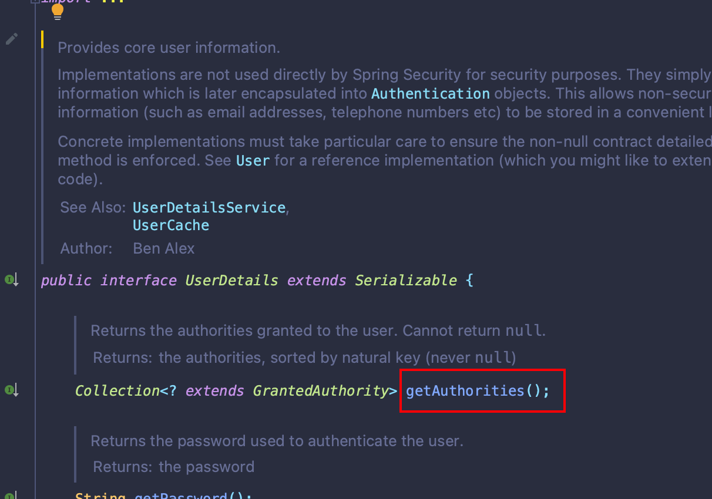
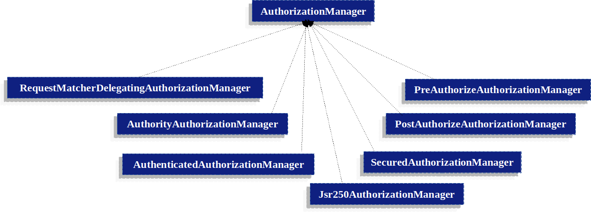

# Authorization

&emsp;在我们解决完Authentication认证之后,就需要进行授权。`Authorization`就是授权的意思，在SpringSecurity中，无论你是采用何种方式进行认证的，其授权服务都可以在我们的Spring应用中使用。

&emsp;在之前的Authentication部分，我们已经能够通过账户密码进行信息认证了，而我们认证的对象`User`实现了`UserDetails`接口，该接口定义了`getAuthorities()`方法，这个方法能够返回认证对象的一组权限。

> 在Spring Security中，角色与权限并无本质上的区别。



&emsp;在Spring Security中，`GrantedAuthority`接口表示授予`Authentication`对象的权限，该接口只提供了一个方法`getAuthority()`。这个方法会被`AuthorizationManager`用来获取权限的字符串表示（AuthorizationManager也是一个接口，也就是说，该接口的实现类会使用getAuthority()方法获取权限），如果无法获取权限字符串，则必须返回`null`。



&emsp;在这些`AuthorizationManager`的实现类中，最常见的就是`AuthorityAuthorizationManager`。该类配置了一组权限，并且可以判断当前`Authentication`对象中是否存在配置的权限，若存在，则会对应的进行授权。

```java
	public AuthorizationDecision check(Supplier<Authentication> authentication, T object) {
		return this.delegate.check(authentication, this.authorities);
	}
```

&emsp;在SpringSecurity中提供了一个`GrantedAuthority`的实现类`SimpleGrantedAuthority`,该类可以通过字符串来表示一个权限，而`UserDetails`接口定义的`getAuthorities()`方法返回的就是`GrantedAuthority`列表。因此，当我们自定义实现`UserDetails`时，就可以通过角色字符串名称创建多个`SimpleGrantedAuthority`来组成一个权限列表即可,例如：

```java
    @Override
    public Collection<? extends GrantedAuthority> getAuthorities() {
        Set<Role> roles = user.getRoles();
        List<SimpleGrantedAuthority> authorities = new ArrayList<>();
         
        for (Role role : roles) {
            authorities.add(new SimpleGrantedAuthority(role.getName()));
        }
         
        return authorities;
    }
```

##  针对请求路径进行授权

&emsp;针对请求路径进行授权就是**针对某一路径，只允许特定权限才能访问**。例如有一个请求路径：`/api/v1/admin/**`,这个路径只允许具有`Admin:All`权限才能访问,那么就可以通过下述配置实现：

```java
@Bean
SecurityFilterChain web(HttpSecurity http) throws Exception {
	http
		.authorizeHttpRequests((authorize) -> authorize
			.requestMatchers("/api/v1/admin/**").hasAuthority('Admin:All')
		)
        // ...

	return http.build();
}
```

&emsp;这种配置是最常用的。当我们想要请求路径`/api/v1/index/**`允许任何人访问，`/api/v1/myhome/**`需要`USER`角色访问，其它路径需要进行认证时，可以通过下述配置：

```java
@Bean
SecurityFilterChain web(HttpSecurity http) throws Exception {
	http
		// ...
		.authorizeHttpRequests(authorize -> authorize                                  
			.requestMatchers("/api/v1/index").permitAll()         
			.requestMatchers("/api/v1/myhome/**").hasRole("ADMIN")                             
			.anyRequest().authenticated()                                              
		);

	return http.build();
}
```

&emsp;除了上述看到的`permitAll`、`hasRole`权限规则以外，常用的权限规则如下：

- `permitAll`: 该规则对应的请求路径不做任何权限授权，而是以公共路径存在。也就是说，该规则对应的路径允许任何请求访问。
- `denyAll`: 该规则对应的请求路径无论在什么情况下，都不会发起请求。也就是说，该规则对应的路径不允许任何请求访问。
- `hasAuthority`: 该规则对应的请求路径要求具备相应的`GrantedAuthority`才可以访问。也就是说，该规则对应的路径只允许具备相关权限才能访问。
- `hasAnyAuthority`: 该规则对应的请求路径要求匹配任意一个`GrantedAuthority`才可以访问。
- `hasRole`: 该规则对应的请求路径要求只有相关的角色才可以访问。
- `hasAnyRole`: 该规则对应的请求路径要求匹配任意一个角色才可以访问。

## 实操案例

&emsp;创建三个API接口：

- `/api/v1/admin/[resource,...]`：只允许`Admin:ALL`权限访问。
- `/api/v1/user/[comment, my_home, ...]`：允许`Admin:ALL`和`User:ALL`访问。
- `/api/v1/home/[images, ...]`：允许`Admin:ALL`、`User:ALL`和`Visitor:ALL`访问

&emsp;然后其它的所有路径都需要进行认证，登录接口和退出接口放开。

### 1. User类

```java
package com.ningning0111.springsecuritystudydemo4.entity;

import lombok.AllArgsConstructor;
import lombok.Builder;
import lombok.Data;
import lombok.NoArgsConstructor;
import org.springframework.security.core.GrantedAuthority;
import org.springframework.security.core.authority.SimpleGrantedAuthority;
import org.springframework.security.core.userdetails.UserDetails;

import java.util.ArrayList;
import java.util.Collection;
import java.util.List;

@Data
@NoArgsConstructor
@AllArgsConstructor
@Builder
public class User implements UserDetails {
    private String username;
    private String password;
    private List<String> authorities;

    @Override
    public Collection<? extends GrantedAuthority> getAuthorities() {
        List<SimpleGrantedAuthority> authoritiesList = new ArrayList<>();
        for(String authority: authorities){
            authoritiesList.add(new SimpleGrantedAuthority(authority));
        }
        return authoritiesList;
    }

    @Override
    public boolean isAccountNonExpired() {
        return true;
    }

    @Override
    public boolean isAccountNonLocked() {
        return true;
    }

    @Override
    public boolean isCredentialsNonExpired() {
        return true;
    }

    @Override
    public boolean isEnabled() {
        return true;
    }
}

```

### 2. UserRepository类

&emsp;为了简单起见，就不连接数据库了，使用内存对用户数据信息进行存储。

```java
package com.ningning0111.springsecuritystudydemo4.repository;

import com.ningning0111.springsecuritystudydemo4.entity.User;
import lombok.RequiredArgsConstructor;
import org.springframework.security.core.userdetails.UsernameNotFoundException;
import org.springframework.security.crypto.bcrypt.BCryptPasswordEncoder;
import org.springframework.security.crypto.password.PasswordEncoder;
import org.springframework.stereotype.Repository;

import java.sql.Array;
import java.util.ArrayList;
import java.util.Arrays;
import java.util.List;

@Repository
@RequiredArgsConstructor
public class UserRepository {
    public User queryByUsername(String username){
        BCryptPasswordEncoder passwordEncoder = new BCryptPasswordEncoder();
        List<User> users = new ArrayList<>();
        User admin = User.builder()
                .username("admin")
                .password(passwordEncoder.encode("123456"))
                .authorities(Arrays.asList("Admin:ALL", "User:ALL","Visitor:ALL"))
                .build();
        User user = User.builder()
                .username("user")
                .password(passwordEncoder.encode("223344"))
                .authorities(Arrays.asList("User:ALL", "Visitor:ALL"))
                .build();
        User visitor = User.builder()
                .username("visitor")
                .password(passwordEncoder.encode("224433"))
                .authorities(List.of("Visitor:ALL"))
                .build();
        users.add(admin);
        users.add(user);
        users.add(visitor);

        for (User item: users){
            if (item.getUsername().equals(username)){
                return item;
            }
        }
        throw new UsernameNotFoundException(username + " does not exist.");
    }
}
```

### 3. ApplicationConfig类

&emsp;ApplicationConfig类在这里主要是用来定义`PasswordEncoder`和`UserDetailsService` Bean的。

```java
package com.ningning0111.springsecuritystudydemo4.config;

import com.ningning0111.springsecuritystudydemo4.repository.UserRepository;
import lombok.RequiredArgsConstructor;
import org.springframework.context.annotation.Bean;
import org.springframework.context.annotation.Configuration;
import org.springframework.security.core.userdetails.UserDetailsService;
import org.springframework.security.crypto.bcrypt.BCryptPasswordEncoder;
import org.springframework.security.crypto.password.PasswordEncoder;

@Configuration
@RequiredArgsConstructor
public class ApplicationConfig {
    private final UserRepository userRepository;
    @Bean
    public UserDetailsService userDetailsService(){
        return userRepository::queryByUsername;
    }

    @Bean
    public PasswordEncoder passwordEncoder() {
        return new BCryptPasswordEncoder();
    }

}
```

### 4. SecurityConfig类

&emsp;SecurityConfig类是用来配置Spring Security，这包括授权配置，也是本案例的重点。

```java
package com.ningning0111.springsecuritystudydemo4.config;

import org.springframework.context.annotation.Bean;
import org.springframework.context.annotation.Configuration;
import org.springframework.security.config.annotation.web.builders.HttpSecurity;
import org.springframework.security.config.annotation.web.configuration.EnableWebSecurity;
import org.springframework.security.config.annotation.web.configurers.AbstractAuthenticationFilterConfigurer;
import org.springframework.security.config.annotation.web.configurers.AbstractHttpConfigurer;
import org.springframework.security.config.annotation.web.configurers.LogoutConfigurer;
import org.springframework.security.web.SecurityFilterChain;

@Configuration
@EnableWebSecurity
public class SecurityConfig {
    @Bean
    public SecurityFilterChain securityFilterChain(HttpSecurity httpSecurity) throws Exception {
        httpSecurity.csrf(AbstractHttpConfigurer::disable);
        httpSecurity.authorizeHttpRequests(authorization -> {
            authorization.requestMatchers("/api/v1/home/**").hasAnyAuthority("Admin:ALL","User:ALL","Visitor:ALL")
                    .requestMatchers("/api/v1/admin/**").hasAuthority("Admin:ALL")
                    .requestMatchers("/api/v1/user/**").hasAnyAuthority("User:ALL","Admin:ALL")
                    .anyRequest()
                    .authenticated();

        });
        httpSecurity.formLogin(AbstractAuthenticationFilterConfigurer::permitAll);
        httpSecurity.logout(LogoutConfigurer::permitAll);
        return httpSecurity.build();
    }
}
```

### 5. Controller类

```java
package com.ningning0111.springsecuritystudydemo4.controller;

import org.springframework.web.bind.annotation.GetMapping;
import org.springframework.web.bind.annotation.RequestMapping;
import org.springframework.web.bind.annotation.RestController;

@RestController
@RequestMapping("/api/v1/admin")
public class AdminController {
    @GetMapping("/resource")
    public String resource(){
        return "This is admin resource";
    }
    @GetMapping("/add_user")
    public String addUser(){
        return "admin add a user.";
    }
}
```

```java
package com.ningning0111.springsecuritystudydemo4.controller;

import org.springframework.web.bind.annotation.RequestMapping;
import org.springframework.web.bind.annotation.RestController;

@RestController
@RequestMapping("/api/v1/user")
public class UserController {
    @RequestMapping("/comment")
    public String comment(){
        return "user comment a statement.";
    }
    @RequestMapping("/my_home")
    public String myHome(){
        return "user's home";
    }
}
```

```java
package com.ningning0111.springsecuritystudydemo4.controller;

import org.springframework.web.bind.annotation.RequestMapping;
import org.springframework.web.bind.annotation.RestController;

@RequestMapping("/api/v1/home")
@RestController
public class VisitorController {
    @RequestMapping("/images")
    public String images(){
        return "load images";
    }
}
```

